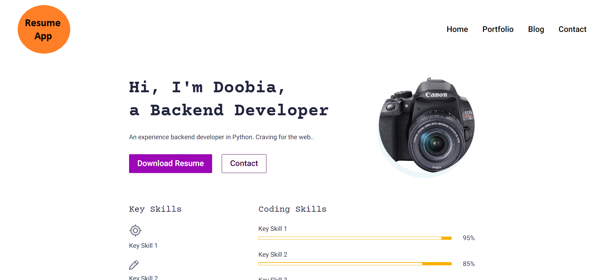

# Digital Resume / CV APP 

## Digital Resume with a Python  Backend  -- Django

### Features
- [x] Create a Resume
- [x] Add certifications with images
- [x] Testimonials 
- [x] Create a Portfolio
- [x] Create a Blog
- [x] Create a Contact Form
- [x] Download Resume as PDF
- [x] Show key skills

### How to run
- Clone the repo  -- `git clone https://github.com/GaoxingAbdullah/resume-cv.git
- Install the requirements -- `pip install -r requirements.txt`
- Run the app -- `python manage.py runserver`
- Open the localhost link in your browser -- `http://localhost:8000/`

### Screenshots
![Home Page](

### License
MIT License
